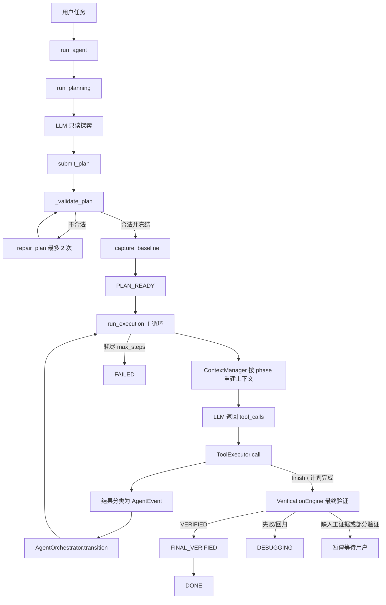
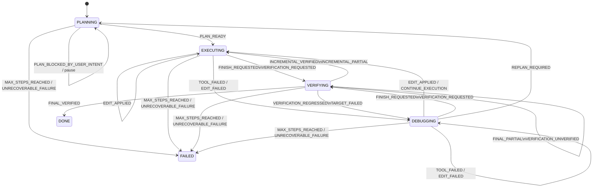
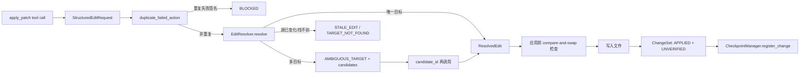

# CodeAgent 核心架构、运行流程与设计审查

> 面向保研 / 科研考核面试的源码导读。本文基于当前仓库真实实现整理，不把接口预留、测试桩或尚未接入主循环的能力写成已经端到端完成的功能。源码行号以当前版本为准。

## 1. 一句话说明：没有 Agent 框架，Agent 是怎样跑起来的

CodeAgent 没有依赖 LangChain、AutoGen、CrewAI 等 Agent 框架。核心是一个手写的、同步的有限状态循环：

1. `run_agent()` 创建工具执行器、LLM 客户端和 `AgentOrchestrator`；
2. `run_planning()` 让 LLM 只用只读工具探索仓库，并通过 `submit_plan` 返回结构化计划；
3. 本地代码校验并冻结 Acceptance Criteria、Verification Contract 和 Execution Plan，同时采集 baseline；
4. `run_execution()` 每轮根据当前 phase 重建有限上下文，调用一次 Chat Completions，让模型返回普通文本和/或 tool calls；
5. `ToolExecutor.call()` 做 phase 权限、路径和命令安全检查，再执行工具；
6. 工具结果或验证结果被翻译为 `AgentEvent`，统一交给 `AgentOrchestrator.transition()` 改变 phase；
7. `finish` 只产生最终验证请求，只有 Evidence Gate 返回 `VERIFIED`，再触发 `FINAL_VERIFIED`，Orchestrator 才允许进入 `DONE`；
8. 超过 `max_steps` 会发出 `MAX_STEPS_REACHED`，强制进入 `FAILED`。

入口可从 [`coding_agent.py`](../coding_agent.py) 的 `run_agent()`（约 950 行）、`run_planning()`（约 638 行）和 `run_execution()`（约 722 行）开始读。



## 2. 源码地图与阅读顺序

| 文件 | 核心职责 | 建议关注入口 |
|---|---|---|
| `coding_agent.py` | 顶层流程、LLM 调用、planning/execution/replanning loop、Event 翻译 | `run_agent`、`run_planning`、`run_execution` |
| `agent_state.py` | 所有跨轮次结构化状态和 phase 常量 | `AgentState` |
| `agent_events.py` | 生命周期 Event 常量与 `AgentEvent` | 全文件 |
| `agent_orchestrator.py` | 唯一的主流程 phase 迁移规则 | `ALLOWED_TRANSITIONS`、`transition` |
| `context_manager.py` | 按 phase 选择信息、限额、重建 LLM messages | `build_messages`、`_sections_for_phase` |
| `tool_registry.py` | 工具 schema、类别和 phase 权限 | `TOOLS`、`PHASE_PERMISSIONS` |
| `tool_executor.py` | 工具实际执行、结构化编辑接入、安全接入 | `call`、`apply_patch`、`run_command` |
| `tool_safety.py` | 工作区路径边界和命令 SAFE/CONFIRM/DENY 策略 | `WorkspaceGuard`、`CommandPolicy` |
| `edit_models.py` / `edit_resolver.py` | Structured Edit、候选定位、ChangeSet 数据结构 | `EditResolver.resolve`、`ChangeSet` |
| `verification_engine.py` | 执行冻结的验证合同、聚合证据、Evidence Gate | `_run`、`_apply_gate` |
| `verification_models.py` | criterion 和总体验证结果模型 | `CriterionResult`、`VerificationResult` |
| `checkpoint_manager.py` | Git stable checkpoint、局部 undo、整体 rollback | `mark_stable`、`undo_changeset`、`rollback_last_stable` |
| `failure_classifier.py` | 将原始失败分类为 `FailureEvent` | `classify_tool_result`、`classify_verification_result` |
| `failure_memory.py` | fingerprint、重复次数、重复失败编辑拦截 | `register_failure`、`duplicate_failed_action` |
| `failure_recovery.py` | 根据连续重复失败决定继续调试、重规划或失败 | `handle_failure` |

## 3. 生命周期状态机

### 3.1 六个 phase 各自做什么

#### PLANNING

- 目的：在改代码之前理解任务、探索仓库、冻结“成功的定义”和验证方式。
- 可见工具：`read_file`、`list_dir`、`search_code`、受限的 `run_command`，以及 planning 专用的 `submit_plan`。
- 产物：`task_understanding`、`acceptance_criteria`、`verification_contract`、`execution_plan`、`clarification_needed`、`baseline`。
- 正常迁移：`PLAN_READY -> EXECUTING`。
- 重规划时也回到此 phase，但只能改 Execution Plan，不能改已冻结的验收标准和验证合同。

#### EXECUTING

- 目的：按 `current_step` 执行检查、实现和计划内验证。
- 可见工具：只读工具、`apply_patch`、`run_command`、`finish`；兼容工具 `write_file` 虽存在于注册表，但不在 phase 权限中，因此主循环不可用。
- 成功编辑产生 `EDIT_APPLIED`，仍处于 `EXECUTING`；这正是 APPLIED 与 VERIFIED 的第一层分离。
- 工具失败产生 `TOOL_FAILED` 或 `EDIT_FAILED`，进入 `DEBUGGING`。
- `finish` 或 execution plan 自动完成只进入 `VERIFYING`。

#### VERIFYING

- 目的：执行 planning 阶段冻结的 Verification Contract，而不是让模型临时决定“测什么”。
- 当前主流程中，`_request_final_verification()` 进入此 phase 后同步调用 `VerificationEngine.run_final_verification()`，通常不会再次询问 LLM。
- `FINAL_VERIFIED -> DONE`；`REGRESSED` / critical target failure -> `DEBUGGING`；`FINAL_PARTIAL` / `VERIFICATION_UNVERIFIED` 保持在 `VERIFYING` 并暂停自主循环。
- 代码中存在 VERIFYING 的工具权限和上下文分支，但当前正常最终验证由引擎同步完成；`run_execution()` 中“VERIFYING 且模型不调用工具”的分支只是兜底，并明确报告没有产生可执行证据动作。

#### DEBUGGING

- 目的：让模型看到当前失败、相关 criterion、相关 ChangeSet、恢复结果和代码，然后修复。
- 成功 `apply_patch`：`EDIT_APPLIED -> EXECUTING`。
- 成功调试命令：`CONTINUE_EXECUTION -> EXECUTING`。
- 普通失败：留在 `DEBUGGING`。
- 同一 fingerprint 连续达到阈值：`REPLAN_REQUIRED -> PLANNING`。
- 同一 fingerprint 跨重规划仍无进展达到阈值：`UNRECOVERABLE_FAILURE -> FAILED`。

#### DONE

- 只允许从 `VERIFYING + FINAL_VERIFIED` 到达。
- 是 terminal phase；之后再交 Event 给 Orchestrator 会抛出异常。

#### FAILED

- 由全局 Event `MAX_STEPS_REACHED` 或 `UNRECOVERABLE_FAILURE` 到达。
- 同样是 terminal phase。

### 3.2 Event 与迁移表

Event 只是不可变数据对象 `AgentEvent(type, reason, payload)`，源码明确说明它“不是 event bus”。调用方同步构造 Event，再同步调用 Orchestrator；没有异步订阅或消息队列。

关键迁移如下：



`AgentOrchestrator.transition()` 还维护以下副作用：

- `FINISH_REQUESTED` 将 `state.verification_mode` 设为 `FINAL`；
- final 验证失败会增加 `failed_finish_attempts`，达到阈值后启用 `finish_guardrail_active`；
- `FINAL_PARTIAL` 与 `VERIFICATION_UNVERIFIED` 设置 `needs_user_confirmation=True` 并要求暂停；
- `REPLAN_REQUIRED` 写入 `replan_reason`，清空上一轮 `failure_analysis`；
- 每次迁移记录到 `phase_history`。

### 3.3 是否有模块绕过 Orchestrator 修改 phase

`AgentState.current_phase` 只允许在 dataclass 初始化时写入；初始化完成后，`AgentState.__setattr__()` 会拒绝普通赋值并提示使用 `AgentOrchestrator.transition()`。原来的公开 `set_phase()` 已删除。Orchestrator 在验证合法迁移后使用 `object.__setattr__()` 完成唯一受控写入。因此当前实现不仅是“主路径约定”，而是在对象层阻止其他模块直接改 phase。Python 仍可被刻意使用底层反射绕过，但正常生产代码已经只有一个 writer。

## 4. 从用户任务到最终结果的完整运行流程

### 4.1 初始化

`run_agent(task, workspace, max_steps, max_planning_steps)`：

1. `ToolExecutor(workspace)` 初始化 `WorkspaceGuard`、`CommandPolicy`、`EditResolver`、`FailureMemory`、`CheckpointManager`；
2. `CheckpointManager.initialize()` 只有在 workspace 是 Git 根目录、工作树干净且存在 HEAD 时，才建立 `checkpoint_000`；
3. 创建标准库实现的 `OpenAICompatibleClient`，直接向 `/chat/completions` POST，不依赖 Agent SDK；
4. 进入 `run_planning()`。

### 4.2 Planning Loop

每轮由 `ContextManager.build_messages()` 生成两条 message：

- system：`PLANNING_PROMPT`，规定只读探索、验收标准和验证合同的生成规则；
- user：当前 phase、原始任务、已有 planning findings 和最近动作等结构化状态。

模型可以继续调用只读工具，或者调用 `submit_plan`。最后一个 planning turn 只暴露 `submit_plan`，强制收敛。连续两轮探索没有增加 `relevant_files`、`relevant_symbols` 或 `confirmed_facts` 时会加入 convergence prompt。

`_validate_plan()` 做两层校验：

- schema：必填字段、枚举、禁止额外字段、AUTO check 必须有 command；
- 语义引用：criterion/check/step ID 唯一，所有引用必须指向已知 criterion，每个 criterion 都要被 verification contract 和 execution plan 覆盖。

合法后写入 `AgentState`，设置第一个 `current_step`，并将 `planning_frozen=True`。不合法时 `_repair_plan()` 最多修复两轮，而且 `validate_repair_scope()` 禁止借“修 JSON”改变 Acceptance Criterion 核心语义。

若 `clarification_needed` 非空，不采 baseline，随后发 `PLAN_BLOCKED_BY_USER_INTENT` 并停止。否则 `_capture_baseline()` 执行所有 `baseline_required=True`、`verification_mode=AUTO` 且有 command 的 check。

### 4.3 Execution / Agent Loop

可把 `run_execution()` 概括为：

```text
for model_turn in 1..max_steps:
    if needs_user_confirmation:
        return pause_summary
    if phase == PLANNING:
        run_replanning(max 3 LLM turns)
    if phase == EXECUTING and execution_plan_complete():
        request final verification
        if DONE or pause: return
        continue

    messages = context_manager.build_messages(state, execution_prompt)
    response = llm.complete(messages, tools_allowed_in_current_phase)

    if response has no tool calls:
        record reminder and continue

    for tool_call in response.tool_calls:
        parse JSON arguments
        result = tools.call(state, name, arguments)
        record compact action and update step progress
        classify failure and update FailureMemory

        if successful finish:
            request final verification
            break  # 不执行同一回复里 finish 后面的工具

        translate tool result to AgentEvent
        orchestrator.transition(state, event)
        if replanning required or plan completed: break

orchestrator.transition(MAX_STEPS_REACHED)
return failure summary
```

这里的 `max_steps` 统计的是 execution loop 的模型轮次，不是工具调用数，也不包含 planning/replanning 内部额外的 LLM 请求。一个模型回复可包含多个 tool calls，因此工具执行次数可能大于 `max_steps`。它能阻止主循环无限运行，但不是全局统一预算。

### 4.4 LLM 每轮看到什么、返回什么

LLM **不会看到完整历史对话轨迹**。`trajectory` 虽然记录了 assistant/tool 事件并用于日志计数，但没有被放回 messages。每轮上下文由 `AgentState` 重建，只发送：

```json
[
  {"role": "system", "content": "当前阶段的行为约束"},
  {"role": "user", "content": "Current phase + 按阶段筛选的结构化状态"}
]
```

模型返回标准 Chat Completions assistant message，主程序读取：

- `content`：仅日志记录；没有 tool call 时通常只记入 `recent_actions`，不会直接视为完成；
- `tool_calls[]`：每项含工具名和 JSON 字符串参数；
- planning/replanning 中的 `submit_plan`、`submit_failure_analysis`、`submit_replan` 也是本地拦截的“控制型工具调用”，不是外部框架行为。

这样设计的好处是状态可解释、上下文不会线性增长；代价是未被结构化保存的推理细节会丢失。

## 5. Planning、Execution Plan、Acceptance Criteria、Verification Contract 与 Baseline

### 5.1 Acceptance Criteria

- 为什么需要：把“任务完成”从模型主观判断改成预先冻结、可验证的条件。
- 输入：用户任务、规划期仓库证据、LLM 的 `submit_plan.acceptance_criteria`。
- 输出：`list[AcceptanceCriterion]`，字段包括 `id`、`description`、`criticality`、`verification_mode`、`evidence_type`、`verification_method`。
- 谁调用/生成：`run_planning()` 接收，`_validate_plan()` 构造并写入 state。
- 影响状态：决定 verification 的覆盖范围、critical failure、人工确认项、DONE gate。
- 失败处理：schema/引用错误进入局部 repair；repair 耗尽则 planning 整体失败。
- 边界：描述“什么算成功”，不描述执行顺序；执行顺序属于 Execution Plan，具体可运行命令属于 Verification Contract。

### 5.2 Verification Contract

- 为什么需要：防止实现后临时挑选容易通过的测试，即避免 moving goalposts。
- 输入：规划阶段 LLM 提交的 checks。
- 输出：`list[VerificationCheck]`，含 `command`、`baseline_required`、关联 criterion 等。
- 调用者：baseline 采集和 `VerificationEngine._run()`。
- 影响状态：形成 `baseline`、`criterion_results`、overall status 和最终 phase。
- 失败处理：AUTO check 无命令会被 planning 校验拒绝；运行时失败成为验证证据，不会偷偷替换检查。
- 边界：只定义如何获得证据，不负责改代码和 phase 迁移。

### 5.3 Execution Plan

- 为什么需要：把任务拆为 `INSPECT`、`IMPLEMENT`、`VERIFY` 三类步骤，并绑定 criterion。
- 输入：`submit_plan.execution_plan` 或 `submit_replan.execution_plan`。
- 输出：`list[ExecutionStep]`、`current_step`、`completed_steps`。
- 调用者：`run_execution()`、`ContextManager`、`_record_tool_event()`。
- 影响状态：成功工具调用会按当前 `step_kind` 自动 `complete_current_step()`；全部完成时自动请求最终验证。
- 失败处理：执行失败先进入 DEBUGGING；反复失败才重规划。
- 边界：`ExecutionStep` 现在显式包含 `expected_change_files` 和 `related_verification_ids`。IMPLEMENT 只有在成功编辑命中声明文件、且产生的 ChangeSet `step_id` 等于当前 step 时才完成；VERIFY 只有实际命令精确匹配所绑定 Verification Check 的冻结 command 时才完成。它仍不理解自然语言描述的语义正确性，最终正确性继续由 Evidence Gate 判断。

### 5.4 Baseline

- 为什么需要：区别“仓库本来就失败”与“Agent 修改后新引入回归”。
- 输入：所有 `baseline_required` 的 AUTO check 命令。
- 输出：`state.baseline = [{verification_id, observation}]`。
- 调用者：planning 尾部 `_capture_baseline()`；验证期 `_regression_delta()` 和 `_regression_check_passed()` 使用。
- 影响状态：决定 `baseline_failures`、`current_failures`、`new_failures`，进而决定 `REGRESSED`。
- 失败处理：baseline 命令失败本身不会阻止进入执行；它被保留用于相对比较。
- 边界：baseline 是原始观察，不是“必须全绿”的门槛。

## 6. Phase-aware Context Management

`ContextManager` 的目标不是保存完整聊天，而是把 `AgentState` 投影成当前 phase 最有用的信息。

| phase | 重点上下文 |
|---|---|
| PLANNING | Task、已有 criteria、planning findings；重规划时额外加入 replan reason、相关失败历史、checkpoint、failure analysis |
| EXECUTING | 已完成/当前/剩余步骤、已应用 ChangeSet、待验证 criterion、相关代码、最近动作 |
| VERIFYING | 冻结 criteria/contract、baseline、ChangeSets、criterion results、回归和人工确认项 |
| DEBUGGING | 当前 failure、failure evidence、相关 criterion/ChangeSet、恢复结果、finish guardrail、相关代码 |

- 输入：`AgentState` 和当前 system prompt。
- 输出：恰好两条 messages。
- 调用者：planning、execution、replanning 每次 LLM 请求前。
- 状态影响：本身只读；但它决定模型下一轮能基于哪些证据决策。
- 失败处理：相关文件越界、不可读或非 UTF-8 时跳过；各 section 按字符预算截断。
- 边界：只负责“选择和渲染上下文”，不负责判断状态迁移、验证真伪或执行工具。

总字符上限默认 18,000。不同 phase 有静态 section budget，最近动作只保留 5 条。`Relevant Code` 从 `relevant_files` 重新读真实工作区；若有 `relevant_symbols`，只抽取符号附近行。一个重要限制是 section 按顺序消耗总预算：靠后的关键信息可能完全被截掉，并没有重要性动态排序。

## 7. Tool System 与 WorkspaceGuard

### 7.1 工具分层

`tool_registry.py` 将工具分为：

- `READ_ONLY`：`read_file`、`list_dir`、`search_code`；
- `MUTATING`：`apply_patch`、兼容用 `write_file`；
- `EXECUTION`：`run_command`；
- `CONTROL`：`finish`。

`tool_schemas_for_phase()` 决定 LLM 看见哪些工具，`ToolExecutor.call()` 又通过 `permission_result()` 做第二次服务端校验，避免模型伪造不可用工具调用。

### 7.2 WorkspaceGuard

- 为什么需要：保证文件操作不越出用户指定 workspace。
- 输入：root 和模型提供的相对/绝对路径。
- 输出：已 resolve 且确认位于 root 内的 `Path`，或拒绝原因。
- 调用者：所有文件工具、命令策略。
- 状态影响：不直接修改 AgentState；阻断后工具返回 `BLOCKED/DENIED`，随后可能触发 DEBUGGING。
- 失败处理：路径穿越和 workspace 外绝对路径直接拒绝。
- 边界：它检查路径归属，不提供操作系统级沙箱；命令风险由 `CommandPolicy` 额外处理。

`CommandPolicy.classify()` 将命令分成 `SAFE`、`CONFIRM`、`DENY`。命令通过 argv 且 `shell=False` 执行；系统级命令被拒绝，移动/删除、依赖变更、未知命令一般要求人工确认。Planning 还额外限制为安全的测试和只读开发查询。

需要注意：`command_path_violation()` 只是基于参数形态的保守检查，不是完整 shell/程序语义分析；一个“安全名单”程序仍可能通过自身参数产生副作用。因此这是应用层护栏，不应描述为强安全沙箱。

## 8. Structured Editing、Resolver 与 ChangeSet

### 8.1 数据流



### 8.2 EditResolver

- 为什么需要：避免模型按模糊文本直接替换错位置。
- 输入：`StructuredEditRequest`、当前文件内容、路径。
- 输出：唯一 `ResolvedEdit`，或 `AMBIGUOUS_TARGET`、`STALE_EDIT`、`TARGET_NOT_FOUND`、`INVALID_EDIT`。
- 调用者：`ToolExecutor.apply_patch()`。
- 状态影响：歧义时在 resolver 内暂存 `pending_request` 和候选；成功后才产生 ChangeSet。
- 失败处理：多候选时返回最多 8 个候选供模型以 `candidate_id` 选择；超过 8 个要求提供更具体 symbol/anchor；单次编辑最多 120 行，禁止整文件替换。
- 边界：只定位编辑区间，不写文件、不判断验证是否通过。

Python 文件通过 AST 得到类/函数 scope；其他语言使用声明正则做 fallback。定位优先级为 symbol scope、anchor 局部上下文、全文件唯一内容。真正写入前再次读取文件，并比较目标区间/源是否变化，降低 resolve 与 apply 之间的竞态风险。

### 8.3 ChangeSet

- 为什么需要：把“已写入”与“已验证”、以及后续 undo 所需信息显式保存。
- 输入：`ResolvedEdit`、写入前后文本、当前 step/phase/checkpoint。
- 输出：`ChangeSet`，初始 `apply_status=APPLIED`、`verification_status=UNVERIFIED`、`rollback_status=NONE`。
- 调用者：`ToolExecutor.apply_patch()` 创建，VerificationEngine 更新验证状态，CheckpointManager 用于 undo/checkpoint。
- 影响状态：追加到 `state.change_sets` 和 `CheckpointManager.pending_changesets`。
- 失败处理：写入失败不会创建 ChangeSet；回归时优先 undo 最新 pending ChangeSet。
- 边界：ChangeSet 记录一个局部编辑，不等价于 Git commit，也不证明 criterion 已满足。

**APPLIED 与 VERIFIED 在实现中确实分离。** `apply_patch` 成功只发 `EDIT_APPLIED` 并留在 EXECUTING；验证引擎之后才批量将 pending ChangeSet 的 `verification_status` 改为 `VERIFIED`、`PARTIALLY_VERIFIED`、`REGRESSED` 或尝试写入 `UNVERIFIED`。但这里有一个真实缺陷：`CheckpointManager.update_change_verification()` 的 allowed 集合包含 `UNVERIFIED/VERIFIED/PARTIALLY_VERIFIED/REGRESSED`，而 VerificationEngine 的 overall 也可能是 `UNVERIFIED`，因此基本匹配；语义上的问题是它把一次总体验证状态批量赋给全部 pending ChangeSet，无法表达某个 ChangeSet 只关联部分 criterion。

## 9. VerificationEngine：Target / Regression / Sanity 与 Evidence Gate

### 9.1 为什么需要

如果由 LLM 自己说“我已经完成”，模型既是实施者又是裁判。`VerificationEngine` 只运行 planning 阶段冻结的命令，并用确定性规则聚合结果，将最终完成权从 LLM 手里拿走。

### 9.2 输入、输出与调用边界

- 输入：`AgentState.acceptance_criteria`、`verification_contract`、`baseline`、human evidence，以及工具执行器。
- 输出：`VerificationResult`，包含每个 criterion 的 PASS/FAIL/UNVERIFIED、三类结果、baseline/current/new failures、critical 列表、manual items、overall status。
- 调用者：当前主流程通过 `_request_final_verification()` 调 `run_final_verification()`；`run_incremental_verification()` 已实现但未接入主循环。
- 影响状态：`verification_result`、`manual_confirmation_items`、ChangeSet verification status、stable checkpoint、失败恢复和 lifecycle Event。
- 失败处理：sanity 失败会停止后续自动 check；回归尝试 undo/rollback；critical failure 进入 DEBUGGING；缺证据/人工项暂停。
- 边界：引擎判定证据，不直接改 phase；`_transition_verification()` 把结果翻译成 Event，再由 Orchestrator 迁移。

### 9.3 三类 evidence

- `SANITY`：低成本基础检查，排序最先；失败后不再运行后续 check，减少在明显坏状态上浪费时间。
- `TARGET`：直接证明用户要求的行为。
- `REGRESSION`：比较修改前 baseline 和当前结果，识别新引入失败。

同一 criterion 关联的所有已观察 AUTO check 都通过才 PASS。当前 CLI 在 planning validation 中明确拒绝 HUMAN criterion，因为命令行入口不能保存并恢复同一 `AgentState`；底层 `submit_human_evidence()` 聚合能力仍保留，但不是当前可达的产品流程。

### 9.4 Evidence Gate 与 overall status

聚合优先级大致为：

1. 有 `new_failures`：`REGRESSED`；
2. critical FAIL/UNVERIFIED、sanity 非 PASS、非关键 AUTO FAIL 等：`UNVERIFIED`；
3. 只剩 manual items：`PARTIALLY_VERIFIED`；
4. 其余：`VERIFIED`。

验证结果还返回机器可读的 `overall_reason` 和 `unverified_reasons[]`。当前原因码包括 `NEW_REGRESSION`、`CRITICAL_CRITERION_FAILED`、`CRITICAL_EVIDENCE_MISSING`、`HUMAN_EVIDENCE_REQUIRED`、`SANITY_CHECK_FAILED`、`NONCRITICAL_AUTO_FAILED` 和 `ALL_REQUIRED_EVIDENCE_PASSED`；每个未通过项同时记录 criterion ID、criticality 和 detail，避免只暴露笼统的 UNVERIFIED。

`_apply_gate()` 在 `VERIFIED` 时记录 confirmed fact，并尝试 `mark_stable()`；在 `REGRESSED` 时恢复；其他失败交给 FailureRecovery 分类。最终 `_transition_verification()` 映射为 lifecycle Event。

### 9.5 finish 能否绕过 Evidence Gate

正常主路径不能：

```text
finish tool -> status SUCCESS, done=False
-> FINISH_REQUESTED
-> Orchestrator: EXECUTING/DEBUGGING -> VERIFYING
-> VerificationEngine.run_final_verification()
-> overall == VERIFIED
-> FINAL_VERIFIED
-> Orchestrator: VERIFYING -> DONE
```

`finish` 返回结果里的 `next_phase=VERIFYING` 只是提示字段，真正 phase 仍由 Orchestrator 修改。模型在同一个回复中把其他 tool call 放在 finish 后面也不会继续执行，因为主循环会 `break`。

不过 `finish_guardrail_active` 当前只改变 DEBUGGING 上下文提示，并不会禁用 `finish` 工具；重复 finish 仍会再次运行相同合同。正确性没有被绕过，但可能浪费模型轮次和测试时间。

### 9.6 baseline-relative regression 是否合理

设计方向合理：

- baseline PASS、current FAIL：明确是新回归；
- baseline FAIL、current PASS：视为改善；
- baseline FAIL、current FAIL：只有解析到新的失败名称才判新回归，原有失败不阻止目标完成。

但实现有明显边界：

- `_failure_names()` 只识别少数 pytest/unittest 风格文本；其他测试框架或输出被截断时可能得到空集合；
- baseline 和 current 都失败且无法解析失败名时，`_regression_check_passed()` 会返回 true，因为无法证明出现了新失败；这是偏宽松策略，可能漏报回归；
- REGRESSION check 缺 baseline 会把 criterion 标为 UNVERIFIED，但 `_regression_delta()` 不产生 new failure；
- baseline 采集失败不会中止执行，合理但必须在面试中说明“相对回归检测依赖失败标识提取质量”。

## 10. Stable Checkpoint、ChangeSet Undo 与 Rollback

### 10.1 三者职责边界

| 机制 | 粒度 | 适用场景 | 核心安全条件 |
|---|---|---|---|
| ChangeSet | 单个局部编辑记录 | 跟踪 applied/verified/rollback 状态 | 创建时保存 before/after、位置和上下文 |
| `undo_changeset()` | 单个 pending ChangeSet | 新回归后优先撤销最新编辑 | 当前文件目标和前后上下文仍完全匹配；同文件无更晚 ChangeSet |
| `rollback_last_stable()` | 当前 checkpoint 后全部 pending 修改 | 局部 undo 不安全，或多次普通失败后整体恢复 | Git checkpoint 可用、HEAD 未漂移、无未知 workspace 修改 |

`StableCheckpoint` 本质是由 Agent 自动创建的 Git commit。初始化要求仓库根目录且干净；只有 Evidence Gate 为 `VERIFIED` 时主流程才调用 `mark_stable()`。虽然 `mark_stable()` 接受 `PARTIALLY_VERIFIED` ChangeSet，当前 `_apply_gate()` 在 PARTIALLY_VERIFIED 分支是 `pass`，因此主路径不会据此建稳定点。

### 10.2 输入、输出与失败处理

- 输入：pending ChangeSets、工作区 Git 状态、verification status。
- 输出：checkpoint 元数据或恢复结果。
- 调用者：ToolExecutor 注册编辑；VerificationEngine 验证/回归恢复；FailureRecovery 在重复普通失败且 pending 多于一个时整体回滚。
- 状态影响：更新 ChangeSet rollback status、pending 列表、`current_checkpoint`、`failed_attempts`、`recent_actions`。
- 失败处理：非 Git、dirty 初始化、HEAD 改变、未知工作区修改都会拒绝 checkpoint/rollback；局部文本不再匹配时拒绝 undo。
- 边界：CheckpointManager 不判断业务正确性，只信任 VerificationEngine 写入的 verification status。

职责总体清楚，但存在两点耦合：VerificationEngine 既判证据又主动执行恢复；CheckpointManager 自己执行 `git reset --hard` 和 `git clean`，虽然有严格前置检查，仍是强副作用模块，测试和调用必须谨慎。

## 11. FailureEvent、FailureMemory 与 fingerprint

### 11.1 FailureEvent

`FailureClassifier` 保留原始 stdout/stderr/status，同时添加粗粒度类型，如 `TEST_FAILED`、`BUILD_FAILED`、`TIMEOUT`、`STALE_EDIT`、`REGRESSION_DETECTED`、`TASK_INCOMPLETE`。记录还包含 location、相关 criterion/ChangeSet、attempt、diagnostic hints、step/phase 和 action signature。

- 为什么需要：将异构工具错误变成可比较、可解释的结构。
- 输入：工具结果或 VerificationResult。
- 输出：`FailureEvent`。
- 调用者：FailureRecovery。
- 影响状态：最终进入 failure history、current failure、failed attempts。
- 失败处理：无法精确识别时用 `UNKNOWN_FAILURE`；原始证据仍保留。
- 边界：分类器不决定 phase，也不执行回滚。

### 11.2 fingerprint

`FailureMemory.build_fingerprint()` 根据 failure type 使用稳定字段：

- test failure：测试名、文件、错误类别；
- build failure：文件、错误类别；
- timeout：归一化命令和 step；
- 其他：文件、symbol、test、related criterion。

随后统一转小写、路径斜杠归一化，并把两位以上数字替换成 `<n>`。`register_failure()` 同时维护历史累计 `repeat_count` 和严格连续的 `consecutive_repeat_count`。

它确实在起作用：FailureRecovery 只用 `consecutive_repeat_count` 达到 3 触发重规划；不同 fingerprint 会重置连续计数。缺点是 fingerprint 对很多普通 failure 不含错误类别或具体 reason，可能把同一文件/criterion 上不同根因合并；数字归一化也可能把有意义的错误码合并。

### 11.3 duplicate failed action

编辑 action signature 包含 file、symbol/anchor、operation、intent 和 new block 的 SHA-256。`ToolExecutor.apply_patch()` 在 resolve/write 前查询历史 failure；若签名一致，返回 `BLOCKED: DUPLICATE_FAILED_ACTION`。

该机制确实能阻止“完全相同的、已经与一次 FailureEvent 关联的编辑”再次执行，但边界很重要：

- 只有失败历史中已有 `action_signature` 才生效；刚刚成功 APPLIED 但尚未验证失败时不会立即阻止重复编辑；
- FailureClassifier 特意不把 `DUPLICATE_FAILED_ACTION` 再注册成新 failure，因此它不会增加连续失败计数；
- candidate_id 路径绕过重复签名检查，因为它复用 pending request；
- signature 包含自然语言 `intent`，同一实际编辑换一种 intent 表述即可绕过；
- verification failure 绑定的是“最后一个 ChangeSet”，多 ChangeSet 场景可能归因不准。

所以它是有效的精确去重护栏，不是语义等价编辑检测器。

## 12. DEBUGGING、Repeated Failure、REPLAN_REQUIRED 与 Replanning

`FailureRecovery.handle_failure()` 的当前策略是：

```text
注册 FailureEvent 和 fingerprint
if regression:
    CONTINUE_DEBUGGING  # VerificationEngine 已做一次恢复
elif same fingerprint consecutive count >= 3:
    若 pending ChangeSet > 1 且可回滚，则回到 stable checkpoint
    该 fingerprint 的 replan_attempts += 1
    no_progress_replan_count = replan_attempts - 1
    if no_progress_replan_count >= 2:
        UNRECOVERABLE_FAILURE
    else:
        REPLAN_REQUIRED
    清零连续 fingerprint 计数
else:
    CONTINUE_DEBUGGING
```

`REPLAN_REQUIRED` 先由 Orchestrator 从 DEBUGGING 迁到 PLANNING。下一次 execution loop 发现 PLANNING，调用 `run_replanning(max_steps=3)`：

1. 先要求 `submit_failure_analysis`，字段包括 previous hypothesis、observed evidence、previous attempts、remaining possibilities、revised hypothesis/plan；
2. 再要求 `submit_replan`；
3. `_validate_replan()` 只替换 Execution Plan，要求仍覆盖全部冻结 criteria；
4. `PLAN_READY` 回到 EXECUTING。

### DEBUGGING → REPLANNING 会不会低效循环

有上限，因此不会无限循环，但可能低效：

- 连续 3 次相同 fingerprint 才重规划；重规划后计数清零，再发生 3 次才会再次判断“无进展”；
- `max_steps` 只计外层 execution model turns，而 `run_replanning()` 内最多 3 次 LLM 调用不计入该预算；
- 是否“无进展”仅用同 fingerprint 的重规划次数推断，没有比较 workspace、验证结果或计划是否真正改变；
- `run_replanning()` 允许只读探索，却没有复用 `_record_tool_event()` 更新 relevant files/symbols，也没有独立 stagnation 判断；
- revised plan 只校验覆盖关系，不校验 step ID 唯一、step kind schema、计划与失败分析的一致性，且没有调用完整 `validate_schema()`。

好处是机制简单、确定性强；当前更值得做的是补齐低成本校验和统一预算，而不是引入复杂的计划相似度模型。

## 13. 容易讲错的语义结论

### 13.1 APPLIED 与 VERIFIED 是否真正分离

**是，主语义已分离。** ChangeSet 写入成功时为 `APPLIED + UNVERIFIED`；只有验证引擎运行后才更新 verification status。`EDIT_APPLIED` 不会进入 DONE。

但验证状态是对全部 pending ChangeSet 的批量赋值，尚未做到 criterion/ChangeSet 级精确归因。

### 13.2 finish 是否能绕过 Evidence Gate

**正常路径不能。** DONE 唯一非全局入口是 `VERIFYING + FINAL_VERIFIED`。finish 只是验证请求。

但 finish guardrail 只是提示，不禁止重复请求；这是效率问题，不是 gate 绕过问题。

### 13.3 PARTIALLY_VERIFIED / UNVERIFIED / HUMAN confirmation 是否闭环

**当前选择是明确禁用 HUMAN，而不是暴露未闭环产品流程。** `_validate_plan()` 会拒绝 `verification_mode=HUMAN`，错误信息明确说明 CLI 没有 resumable confirmation channel，并要求使用可执行的 AUTO evidence。原来的 `USER_CONFIRMATION_REQUIRED`、`USER_CONFIRMED` 幽灵 Event 已删除。底层 `submit_human_evidence()` 仍可独立调用和测试，但正常 `run_agent()` 无法规划出 HUMAN criterion，因此不会误导用户认为 CLI 能暂停后续跑。

AUTO `UNVERIFIED` 仍可能导致暂停或调试，但现在有 `overall_reason` 和逐 criterion 的 `unverified_reasons`，可区分 critical failure、证据缺失、sanity failure 等原因。

### 13.4 Incremental verification 是否已在运行

`run_incremental_verification()` 和 `INCREMENTAL_VERIFIED/PARTIAL` 迁移已实现，但 `run_execution()` 没有调用它。当前真正接通的是 final verification。面试时应说“有模块能力和状态迁移预留，尚未接入主 loop”。

### 13.5 max_steps 是否完全防无限循环

它可靠地终止 `run_execution()` 外层循环，并通过全局 Event 进入 FAILED；但不是全局请求预算：initial planning 最多 `max_planning_steps`，每次 replanning 又可额外调用最多 3 次 LLM，planning repair 还可额外调用 2 次。因此应描述为“主执行循环熔断器”，而非整个程序的绝对步数上限。

## 14. 各模块统一问答速查

| 模块 | 为什么需要 | 输入 | 输出 | 调用者 | 影响状态 | 失败后 | 边界 |
|---|---|---|---|---|---|---|---|
| AgentOrchestrator | 集中生命周期规则 | state + AgentEvent | TransitionResult | 顶层 loop/结果翻译函数 | phase、确认标志、历史、finish 计数 | illegal transition 抛错 | 不执行工具、不判证据 |
| ContextManager | 控制上下文长度与阶段相关性 | state + prompt | 2 条 messages | 三类 loop | 间接影响模型决策 | 跳过不可读文件、截断 | 不修改 phase/代码 |
| Planning | 先冻结成功定义 | task + 只读证据 | criteria/contract/plan/baseline | run_agent | planning fields | repair 或终止 | 不改产品代码 |
| ToolExecutor | 统一执行边界 | phase/name/args | 结构化 result | loop/verification | 编辑时写 ChangeSet | 捕获异常返回 FAILED | 不直接迁移 phase |
| WorkspaceGuard/Policy | 限制路径和命令风险 | path/argv | resolved path/decision | ToolExecutor | 失败可间接进 DEBUGGING | BLOCK/DENY/CONFIRM | 非 OS 沙箱 |
| EditResolver | 精确定位小范围编辑 | request + source | ResolvedEdit/候选/错误 | apply_patch | pending candidate | 重新读/选 candidate | 不写文件 |
| ChangeSet | 显式分开 apply/verify/rollback | edit before/after | 编辑记录 | executor/verification/checkpoint | change_sets | undo/rollback | 非 commit、非成功证明 |
| VerificationEngine | 独立证据门 | frozen contract + baseline | VerificationResult | final request；增量入口未接 | verification、checkpoint、failure | debug/pause/recover | 不直接迁移 phase |
| CheckpointManager | 可恢复稳定状态 | Git + ChangeSets | checkpoint/recovery | tools/verification/recovery | rollback/checkpoint fields | 保守拒绝 | 不判业务正确性 |
| FailureClassifier | 统一失败形状 | raw result | FailureEvent | FailureRecovery | 无直接写入 | UNKNOWN fallback | 不决定策略 |
| FailureMemory | 识别重复失败 | FailureEvent/history | fingerprint/record | FailureRecovery/ToolExecutor | failure history/counters | 精确去重可能漏/误合并 | 不重规划 |
| FailureRecovery | 确定性升级策略 | FailureEvent | decision | execution/verification | evidence、attempts、replan counts | replan 或 FAILED | 不调用 LLM 分析 |
| Replanning | 改策略不改目标 | frozen plan + failure evidence | failure analysis + new plan | execution loop | execution plan/current step | 3 轮耗尽报错 | 不改 criteria/contract/baseline |

## 15. 当前设计审查与可改进点

### 15.1 合理、建议保留的设计

1. **手写显式状态机。** `ALLOWED_TRANSITIONS` 很适合面试解释，也能阻止 finish 直接 DONE。
2. **冻结 Acceptance Criteria 和 Verification Contract。** 这是系统最有价值的正确性约束，避免验收标准随实现漂移。
3. **环境证据 gate。** LLM 负责提出动作，确定性代码负责执行和判定，职责方向正确。
4. **APPLIED / VERIFIED / rollback 三个维度分开。** 比单一 success 标志更能表达真实软件修改生命周期。
5. **phase-aware context 重建。** 不依赖完整历史，成本可控、状态可审计。
6. **WorkspaceGuard + phase permissions + command policy 三层护栏。** 即使不是强沙箱，也明显优于直接执行任意字符串。
7. **局部 undo 优先、stable checkpoint 兜底。** 恢复粒度合理，而且对未知工作区修改采取保守拒绝。
8. **保留原始错误证据再做粗分类。** fingerprint 失准时仍可追溯 stdout/stderr。

### 15.2 已落实的原 P0 改进

#### P0-1：HUMAN 流程明确禁用

当前采用最小且诚实的边界：planning validation 拒绝 HUMAN，提示缺少可恢复确认通道；同时删除两个未接线的 USER confirmation Event。未来只有在实现 state 持久化/resume 后才应重新开放。

#### P0-2：UNVERIFIED 增加明确 reason

`VerificationResult` 已增加 `overall_reason` 和结构化 `unverified_reasons`，报告也会输出主要 reason。原因已经与 criterion 和 criticality 绑定。后续可继续细分“sanity 短路导致未执行”，但当前已不再只有一个无解释的 UNVERIFIED 字符串。

#### P0-3：ExecutionStep 与真实 ChangeSet/check 绑定

`ExecutionStep.expected_change_files` 约束 IMPLEMENT；`related_verification_ids` 约束 VERIFY。Planning/Replan schema 要求两个字段存在，并按 step kind 要求相应绑定非空。ChangeSet 保存关联 criteria 和 verification IDs，使进度、编辑和验证合同能够回溯。

#### P0-4：Replan 复用完整 schema validation

`_validate_replan()` 先调用 `validate_schema()`，再检查 step ID 唯一、frozen criterion 覆盖、verification ID 引用和按 step kind 的绑定规则；不再只依赖 dataclass 构造。

### 15.3 P1：明显提高稳定性或可解释性

#### P1-1：统一全局 LLM/tool 预算

把 initial planning、repair、execution、replanning 的 LLM 请求都计入一个 `Budget`，同时记录 tool call 数和验证命令耗时。保留现有各阶段局部上限，但再加全局熔断，避免“max_steps=12”实际远多于 12 次模型请求造成解释歧义。

#### P1-2：把 finish guardrail 从提示升级为节流

当验证输入未变化（ChangeSet、human evidence、contract 均无变化）且刚刚 final verification 失败时，可直接返回上次结果，或暂时不向模型暴露 finish，直到有新动作。无需语义相似度，只需比较确定性 state version。

#### P1-3：增强 baseline 回归结果的三态表达

当 baseline/current 都失败但无法解析 failure names 时，不应直接当作 regression check passed；更诚实的是 `INCONCLUSIVE/UNVERIFIED`。同时为 pytest、unittest、常见 JS/Java runner 提供可插拔的失败标识提取器。先支持项目实际使用的 runner，不必做通用日志 AI 解析。

#### P1-4（已落实）：Orchestrator 成为唯一 phase writer

`set_phase()` 已移除，AgentState 阻止初始化后的 `current_phase` 普通赋值；Orchestrator 在合法迁移表校验后执行唯一受控写入，并有测试覆盖旁路赋值会失败。

#### P1-5：让 ChangeSet 验证状态与 criterion/check 建立关联

目前 overall status 批量写给所有 pending ChangeSet。建议 ChangeSet 保存 `related_acceptance_criteria` 或 `verification_ids`，仅在关联证据通过时更新；最终 stable checkpoint 仍可要求所有 pending 修改均达到可接受状态。

#### P1-6：明确 VerificationEngine 与 Recovery 的边界

现在 `_apply_gate()` 既聚合证据，又调用 `undo_changeset/rollback`，FailureRecovery 也会触发 rollback。建议 VerificationEngine 只返回 `RecoveryRecommendation`，由一个单独的 recovery coordinator 执行；如果保持简单，也至少把“每个 failure 只允许一个恢复动作”写成显式条件并测试。

#### P1-7（已落实）：清理过期文案和幽灵 Event

VERIFYING 兜底信息已改为准确描述“没有产生可执行证据动作”；`USER_CONFIRMATION_REQUIRED`、`USER_CONFIRMED` 已从事件定义、README 和测试中移除。

### 15.4 P2：锦上添花，可以以后做

#### P2-1：改善 Context budget 的优先级

在硬截断前，保证 current failure、current step、unmet critical criteria 等必需块有最低保留额；日志和代码片段再共享剩余预算。

#### P2-2：为 fingerprint 增加可解释组成字段

除拼接后的字符串，再保存 `fingerprint_components`，便于面试演示和调试误合并。只有观测到误判后再调整规则。

#### P2-3：接入真正的 incremental verification

在一个 VERIFY step 或 ChangeSet 完成后，只运行关联 criterion 的检查，成功后回 EXECUTING；最终仍完整 gate。适合验证命令昂贵的项目，小项目收益有限。

#### P2-4：状态持久化和可视化轨迹

把 `AgentState`、phase history、verification reports 写为 JSON，支持断点恢复和面试演示。当前单进程 CLI 若只用于原型，不是立即必需。

### 15.5 暂时不建议的过度设计

- 不建议为了“更智能重规划”引入多 Agent 辩论、向量库或 Agent 框架；会违背任务要求，也削弱可解释性。
- 不建议现在做通用语义计划相似度模型；确定性比较 state version、命令和 ChangeSet 已足够解决重复循环的大部分问题。
- 不建议自研完整事务文件系统；现有局部 CAS undo + Git checkpoint 对原型足够。
- 不建议把所有 Event 改成异步 event bus；当前同步调用链更容易证明顺序和正确性。
- 不建议为所有语言构建完整 AST 编辑器；按实际项目语言逐步增加 resolver 即可。

## 16. 面试时可用的总结回答

如果老师问“没有 Agent 框架，你的 Agent 核心逻辑怎么实现”，可以这样回答：

> 我把 Agent 拆成四层。第一层是手写有限状态机，`AgentOrchestrator` 只接受显式 Event，控制 PLANNING、EXECUTING、VERIFYING、DEBUGGING 到终态的合法迁移；第二层是 phase-aware loop，每轮从 `AgentState` 重建上下文并直接调用 Chat Completions，解析模型返回的 tool calls；第三层是受控工具执行，包含 phase 权限、workspace 路径保护、命令风险策略和结构化局部编辑，编辑成功只产生 APPLIED 的 ChangeSet；第四层是独立 Evidence Gate，只执行规划期冻结的 target、regression、sanity checks。`finish` 只是请求验证，只有最终证据为 VERIFIED 才会产生 `FINAL_VERIFIED` 并进入 DONE。失败会结构化成 `FailureEvent`，用 fingerprint 判断连续重复，必要时局部 undo、回滚稳定 checkpoint 或冻结验收标准后重规划。外层 `max_steps` 是执行循环熔断器。

还应主动补充当前边界：

> 当前 final automatic verification 已闭环；HUMAN planning 因没有 resumable CLI 通道而被明确禁用，不再暴露半闭环流程；incremental verification 仍只有引擎/状态层能力。ExecutionStep 已与 ChangeSet/check 绑定，Replan 复用完整 schema，UNVERIFIED 有明确 reason，phase 也只能由 Orchestrator 写入。剩余边界主要是 baseline-relative regression 依赖失败名提取，以及全局 LLM 请求预算尚未统一。
